# Please read this before you do one of the biggest mistakes in your life - **_Invest in Dropil_**.

## Securities and Exchange Commission v. Dropil, Inc., Jeremy McAlpine, Zachary Matar, and Patrick O'Hara

 vs   

## No. 8:20-cv-00793 (C.D. Cal., filed April 23, 2020)

### Links with facts and reality.

[SEC Charges Founders and Issuer for Conducting Fraudulent and Unregistered Ico](https://www.sec.gov/litigation/litreleases/2020/lr24804.htm) 
[Case 8:20-cv-00793 Document 1 Filed 04/23/20](https://www.sec.gov/litigation/complaints/2020/comp24804.pdf)

### The truth behind the "trading bot" called Dex and the **Dropil Team** . 

`("Truth" is most often used to mean being in accord with fact or reality)`

### What was Dex (the Lie) ? 

_( according to the white paper and why all the people invest in the platform )_ 

 
 
 
 
The Dropil team stated that had collected "_50 millions $_" from the ICO. Which "_50 millions dollars_" will fund "the trading bot" **Dex**. 
 
 
 
Dex would aggregate all the investors funds, giving massive advantage to trades ? Trading on the Binance exchange ? 
 
_Sufficient capital to allow maximum diversification_ ? the 50 mil $ from the ICO ? 
 
 
 
 
 

[The beginning of the Lie](https://www.youtube.com/watch?v=o3N_TaJikb4)

## What was Dex in reality ? 

_( - Vision, hallucination, phantasm, fraud, sham, falsify, charlatan - )_ 

  
 
Dex was NEVER profitable! 
So there wasn't a "trading bot", and everything about that the Dropil team can **create** or **CODE** a _trading bot was a lie !_  
You can find video clips of Zachary Matar on YouTube presenting Dex, pushing "the manipulation" that it was real. 
But this just shows _Dropil_ true nature ! 
The true nature of the people behind this fraud.  
 
In reality, and proven by facts (SEC) **Dex NEVER traded on Binance**.  
Aren't you already asking yourself, but, but how ALL OF THIS IS possible ? 
For the people, being lied since the beginning of this sham project will be hard to acknowledge **the Truth**. 
 
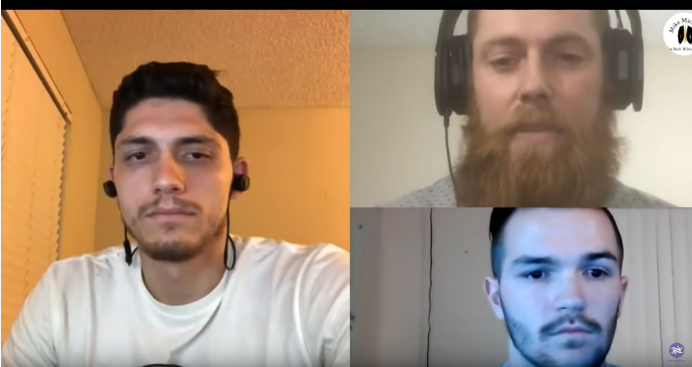 
You have to get to know the Dropil team a bit better to understand why this is very, very possible and in fact **_absolutely real_**. 
 

### Dropil and its founders claimed that Dex would **generate profits** that would be distributed to investors. 

  
 
 
Only with a single product ? This single product **_the trading Bot - Dex_** ! wow, Amazing !  
And you should know already that no matter how many products they produce and **knowing** what they have produced already, any **_positive outcome_** is under series of **BIG Question marks _"????????"_**  

Do you think that the "trading bot" **Jade** _is real ?_ 
 

### Jade Exposed

### The ICO or the FIASCO ?

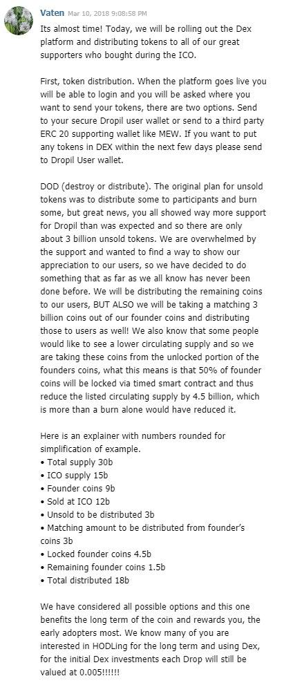 
 
In reality, the sale of DROPs during the ICO phase raised less than $1.9 million, not the $50 million claimed.  
 
 
 
Are you surprised that they LIED again ? 
You shouldn't be ! 

### The Dropil team covering its tracks. 

On 28 feb 2020 the "trading bot" called Dex vanished from this world, like a ghost... 
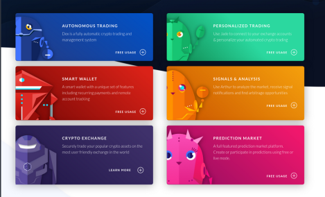 <!-- .element height="50%" width="50%" --> 
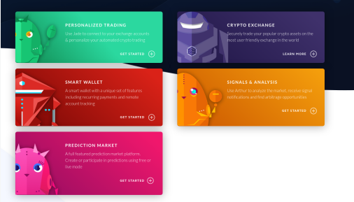 <!-- .element height="50%" width="50%" -->   
But even now (4th May 2020), We can login to the Dex portal. 
Dex seems to be still active and actively trading something! Trading Somewhere, probably Binance! 
Even without any funds! Even without being on exchanges! Even without making any trades! 
This is what we should call a real "Technology". 
Dex just cant stop making profits ! 2.06% on Aggressive ! 
 
**Dex is a Unstoppable Force and Nobody can stop it! Dex just keeps trading!** 
 
Even the SEC does not have jurisdiction over the trading that Dex is doing !  
 
They are still trying to keep this fiasco up and running. 

You will ask but how is that possible after so many evidence and facts ? 

Even the SEC is currently investigating them and fighting them in court, how is this possible ?  

### Examples of the Dropil team dumping through the years.

[Simple proof and investigation](https://github.com/bonyoC-137/Dropil-ICO-fraud-exposed) 

More dump and more lies... 
[0xb011ad4c57153f1b069be15170123958d3b3537e](https://etherscan.io/token/0x4672bad527107471cb5067a887f4656d585a8a31?a=0xb011ad4c57153f1b069be15170123958d3b3537e) 
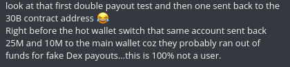  
[0x27bdc1a83b737c867f2fab623438f029f6670fd8](https://etherscan.io/token/0x4672bad527107471cb5067a887f4656d585a8a31?a=0x27bdc1a83b737c867f2fab623438f029f6670fd8) 
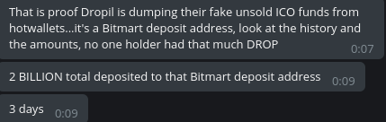 

### The idea behind "the buyback" - or the **_money laundering_** 

### The Re-Branding and The Zuhex.

You can see when this domain was registered. 
When was the domain registered zuhex[dot]dev - **4th January 2020** 
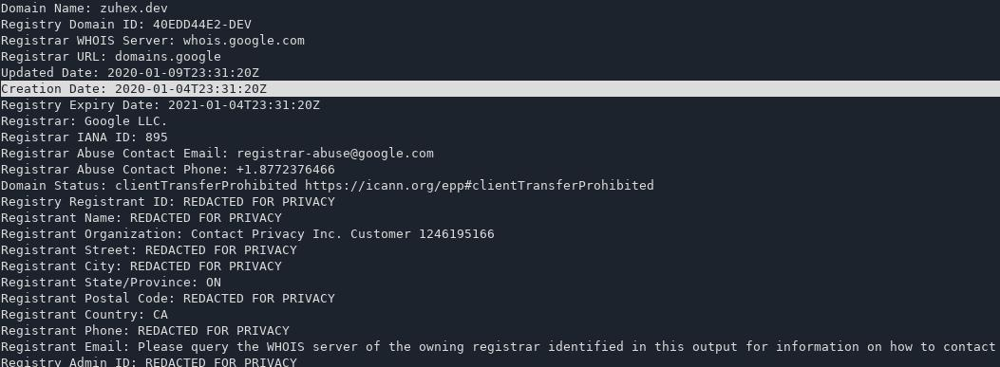 
When it was announced ? **22 August 2019** 
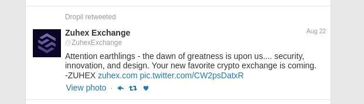 

And what they have produced ? Another simple Lie. 
An exchange which back-engine is just another Excel Spreadsheet. Saying another because this is The new version of Dex, now Zuhex. 
`[D]ex` 
`[Zuh]ex` 

Since the announcment of Zuhex on twitter, 8 or more months ago ? Some people still believe, other just hope now... 

"Everything is build on HOPE", sadly even the fraud. 

### The Manipulation !

There is no limit to that. Not for the Dropil team. 

Learn from them how to keep the hype going, no matter if you sued by the SEC for fraud, no matter you have provided fabricated documents, lied to hundred of thousands of people, every day. There is no shame, it seems that there is no fear even. 

During all that time so many other exchanges asked for Listing the DROP token to their platform, publicly inside the group chat. 
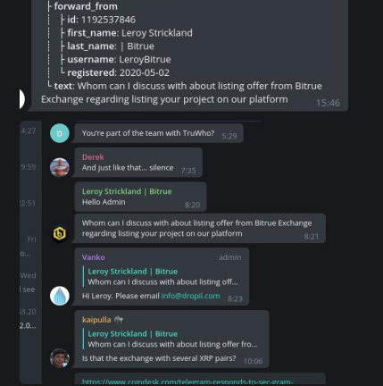 
As you already noticed, this account was created just the same date and time when he posted a exchange listing request - **Leroy Strickland | bitrue**. 
I think there is no need to contact bitrue for questions. 
Soon we will add more examples just like this 

And so many weird posts in the group chat by people who never spoke before. 
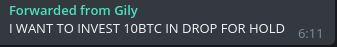 
The side of the Bride.

### Voltvex - the place you really do NOT want to host anything.

Or more correct to say is: 
**The place where you can host your Fraud project.** 
but only if the Dropil team allows it. 

### DROPIL Backstage

Meet the system admin.  
Meet the .net expert.  

 
 
Meet the engine behind Dex. The backstage-accountant-engine. 
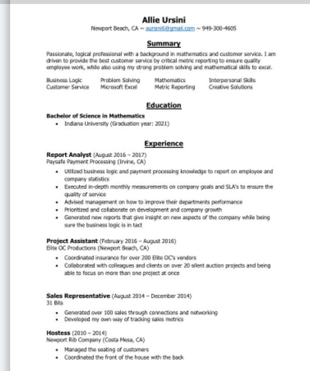 
 
 
 
 
 
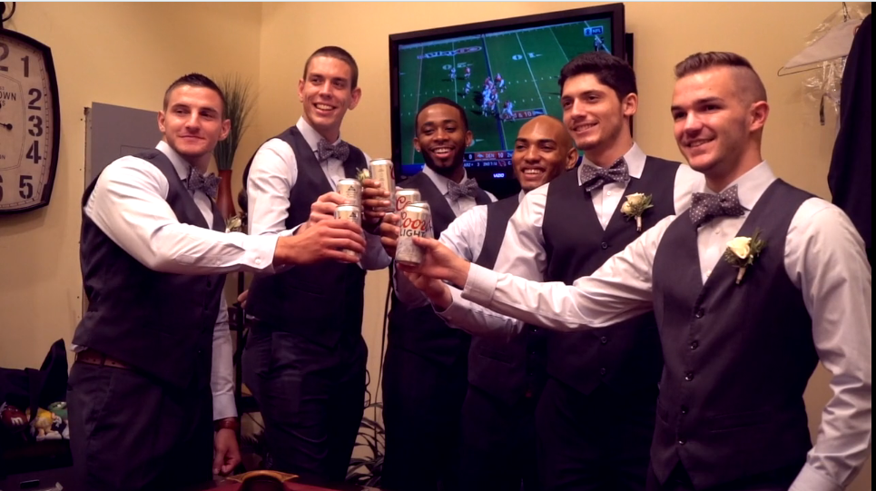 
