# Please read this before you do one of the biggest mistakes in your life - **_Invest in Dropil_**.

## Securities and Exchange Commission v. Dropil, Inc., Jeremy McAlpine, Zachary Matar, and Patrick O'Hara

 vs   

## No. 8:20-cv-00793 (C.D. Cal., filed April 23, 2020)

### Links with facts and reality.

[SEC Charges Founders and Issuer for Conducting Fraudulent and Unregistered Ico](https://www.sec.gov/litigation/litreleases/2020/lr24804.htm) 
[Case 8:20-cv-00793 Document 1 Filed 04/23/20](https://www.sec.gov/litigation/complaints/2020/comp24804.pdf)

### The truth behind the "trading bot" called Dex and the **Dropil Team** . 

`("Truth" is most often used to mean being in accord with fact or reality)`

### What was Dex (the Lie) ? 

_( according to the white paper and why all the people invest in the platform )_ 

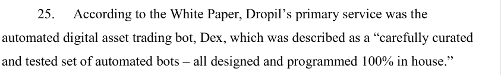 
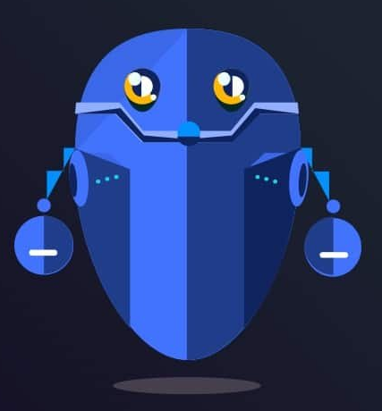 
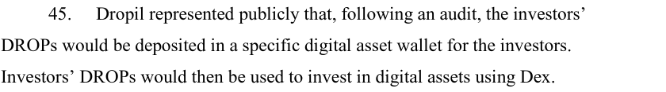  
The Dropil team stated that had collected "_50 millions $_" from the ICO. Which "_50 millions dollars_" will fund "the trading bot" **Dex**. 
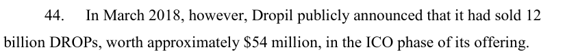   
Dex would aggregate all the investors funds, giving massive advantage to trades ? Trading on the Binance exchange ? 
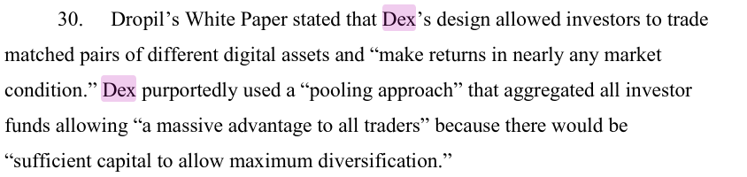 
_Sufficient capital to allow maximum diversification_ ? the 50 mil $ from the ICO ?   
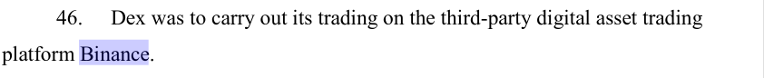   

## What was Dex in reality ? 

_( - Vision, hallucination, phantasm, fraud, sham, falsify, charlatan - )_ 

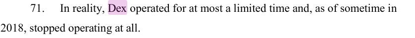 
 
 
Dex was NEVER profitable! 
So there wasn't a "trading bot", and everything about that Dropil team can **create** or **CODE** a _trading bot was a lie !_ 
 
You can find video clips of Zachary Matar on YouTube presenting Dex, pushing "the manipulation" that it was real. 
But this just shows _Dropil_ true nature ! 
The true nature of the people behind this fraud. 
 

Do you think that the trading bot called **Jade** _is real ?_ , oh please, think again... 
We will get there !   
 
 
In reality, and proven by facts - **Dex NEVER traded on Binance**. 
Aren't you already asking yourself, but how is this possible ? 
 
For the people, being lied since the beginning of this sham project will be hard to acknowledge **the Truth**.  

You have to get to know the Dropil team a bit better to understand why this is very, very possible and absolutely real.  

### Dropil and its founders claimed that Dex would generate profits that would be distributed to investors. 

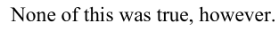 
 
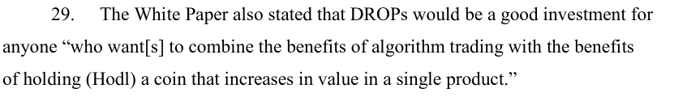 
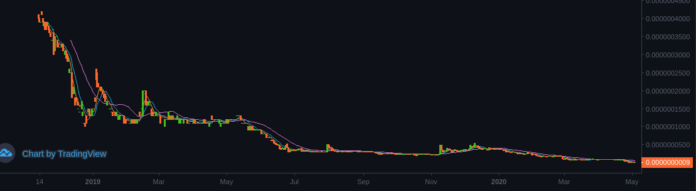 
Only with a single product ? This single product **_the trading Bot - Dex_** ! WoW ! Amazing ! 
 
And Sadly i have to share my opinion, that until now as a "ex investor" in Dropil sham(project-platform), that no matter how many products they produce and knowing what they have produced already, any positive outcome is under BIG Question mark "?" and only go-in if you are one lucky Pro-Trader dude and you are willing to test your trading abilities against them. 
 

### In reality, the sale of DROPs during the ICO phase raised less than $1.9 million, not the $54 million claimed. 

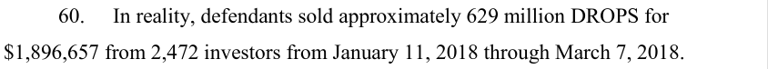 
 

### The Dropil team constantly deleting and covering its tracks. 

They are still trying to keep this fiasco up and going. You will ask but how is that possible after so many evidence and facts ? Even the SEC is currently investigating them and fighting them in court, how is this possible ? 
 
On 28 feb 2020 the "trading bot" called Dex vanished from this world, like a ghost... 
 <!-- .element height="10%" width="10%" -->  <!-- .element height="10%" width="10%" -->  
 
 
But even now, if We login to the Dex portal. 
Dex seems to be still active and actively trading something, somewhere ! 
Dex never stops ! 
Even without any funds ! 
Even without being on exchanges ! 
Even without making any trades ! 
This is what we should call a real "Technology". 
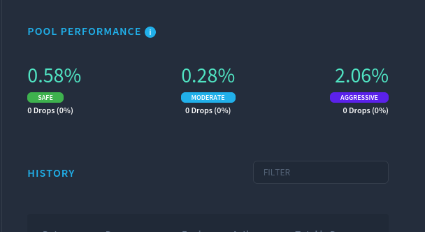 
**Dex is a unstoppable force and Nobody cant stop it !** 
**Dex just keeps trading !** 
Even the SEC does not have jurisdiction over the trading that Dex is doing ! 
 
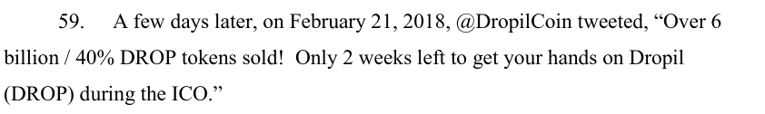 
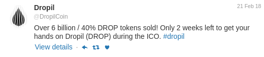 
