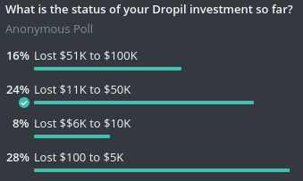

# Securities and Exchange Commission v. Dropil, Inc., Jeremy McAlpine, Zachary Matar, and Patrick O'Hara

# No. 8:20-cv-00793 (C.D. Cal., filed April 23, 2020)

## Links

[SEC Charges Founders and Issuer for Conducting Fraudulent and Unregistered Ico](https://www.sec.gov/litigation/litreleases/2020/lr24804.htm) 
[Case 8:20-cv-00793 Document 1 Filed 04/23/20](https://www.sec.gov/litigation/complaints/2020/comp24804.pdf)

### Story about a "trading bot" called Dex. 

 

#### Dropil and its founders claimed that Dex would generate profits that would be distributed to investors as additional DROPs every 15 days. 

  
 
 
  

#### In reality, the sale of DROPs during the ICO phase raised less than $1.9 million, not the $54 million claimed. 

  
 
(You will not find this on twitter, because the Dropil team constantly is deleting and covering its tracks.) 
 
  
